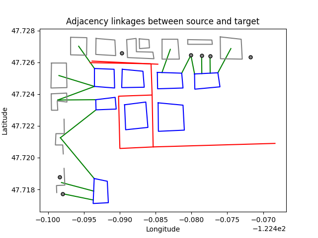

# Geo-Adjacency
Pip [repository](https://pypi.org/project/geo-adjacency/)

Full [documentation](https://asmyth01.github.io/geo-adjacency/index.html)

# Installation
It's recommended to use a virtual environment to install this tool, since its dependencies may 
require different versions than what is installed on your system.

## pip
Recommended installation is with [pip](https://pypi.org/project/pip/):

```python -m pip install geo-adjacency```

## Build from source
You must have Python <3.13,>=3.9 installed.
```
$ git clone git@github.com:asmyth01/geo-adjacency.git
$ cd geo-adjacency
$ poetry install
```
Or with [build](https://pypa-build.readthedocs.io/en/latest/).
```
$ git clone git@github.com:asmyth01/geo-adjacency.git
$ cd geo-adjacency
$ python -m build
```

# Example Usage
_See the [docs](https://asmyth01.github.io/geo-adjacency/index.html) for details._

1.  Load the data. geo-adjacency expects you to provide your data as Shapely geometries. You will provide three lists: source_geoemtries, target_geometries, and obstacle_geometries. What we are analyzing is which of the source geometries are adjacent to which of the target geometries. Obstacles can prevent a source and target from being adjacent, but they do not participate in the adjacency dictionary.
2. Create an AdjacencyEngine. In this case, we'll load the sample data which is available on `Github <https://github.com/asmyth01/geo-adjacency/>`_.

   ```python
   s, t, o = load_test_geoms("../tests/sample_data")
      engine = AdjacencyEngine(s , t, o, True)
   ```
3. Run the analysis
      ```python
      output = engine.get_adjacency_dict()
      # defaultdict(<class 'list'>, {0: [1, 2], 1: [1], 2: [1], 3: [2], 6: [1], 7: [1]})
      ```

    The output is a dictionary. Keys are the indices of source geometries in the input list, and values are a list of indices of adjacent target geometries in the input list.

4. You can visualize the output with a handy built-in method which uses pyplot.
   `engine.plot_adjacency_dict()`. (Source geoms are grey, targets are blue, obstacles are red. Linkages are green.

    

5.  You probably will want to match the adjacency dictionary back to the original data so that you can do something cool with it.
```python
      for source_i, target_i_list in output.items():
          source_geom = source_geometries[source_i]
          target_geoms = [target_geometries[i] for i in target_i_list]
```

